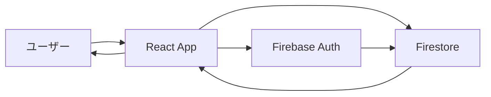

# アーキテクチャ設計

## システム構成

### フロントエンド

- **React 18+**: UI フレームワーク
- **TypeScript**: 型安全性
- **Vite**: 開発サーバー・ビルドツール
- **React Router**: ルーティング
- **Chart.js/Recharts**: グラフ表示

### バックエンド（Firebase）

- **Firestore**: データベース
- **Authentication**: 認証
- **Hosting**: 静的ファイル配信（Vercel 使用）

### デプロイ

- **Vercel**: フロントエンドデプロイ
- **Firebase**: バックエンドサービス

## データフロー

## セキュリティ設計

- ユーザー認証によるデータ分離
- Firestore セキュリティルール
- クライアントサイドでのデータ暗号化
- HTTPS 通信の強制

## スケーラビリティ

- Firebase の自動スケーリング機能
- クライアントサイドでのデータ処理
- 効率的なデータ構造設計
