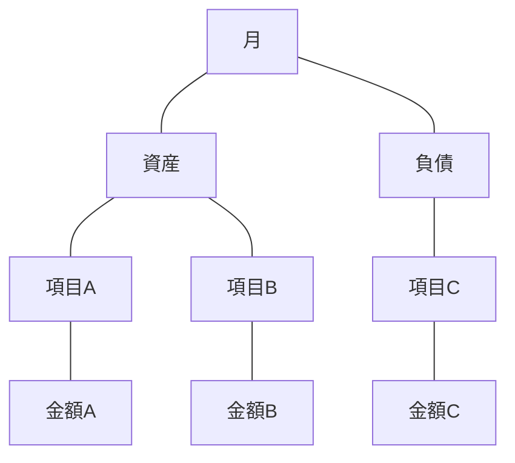
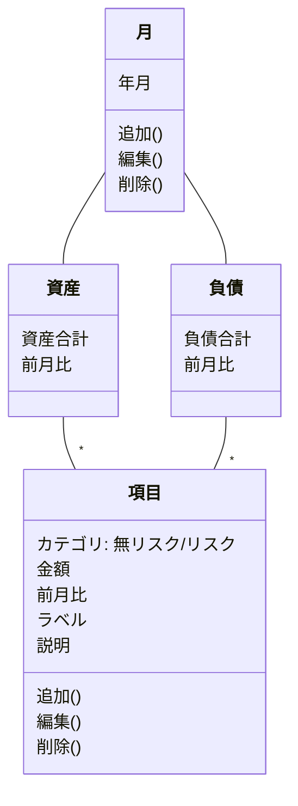
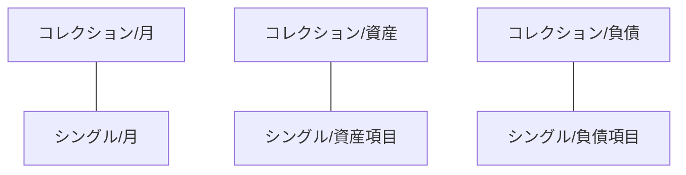
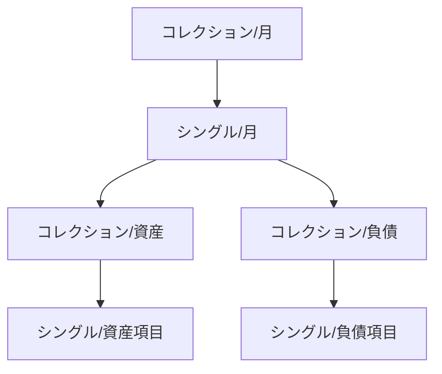

# 資産機能

## 1. オブジェクトの抽出

### 1-1. タスクの洗い出し & 「名詞」の抽出

- 「資産推移」を確認する
- 「先月」の「資産」を確認する
- 「先月」の「資産」のうちの「流動資産」を確認する
- 「先月」の「流動資産」のうちの「財布」の「金額」を確認する
- 「今月」の「負債」のうちの「住宅ローン」を入力する
- 「今月」の「流動資産」に「PayPay」を追加する

### 1-2. 「名詞」とそれらの関係を抽出する

### 1-3. サブオブジェクトをプロパティにする

## 2. ビューとナビゲーションの検討

### 2-1. メインオブジェクトに「コレクション」と「シングル」のビューを与える

### 2-2. コレクションビューとシングルビューの呼び出し関係を検討する

